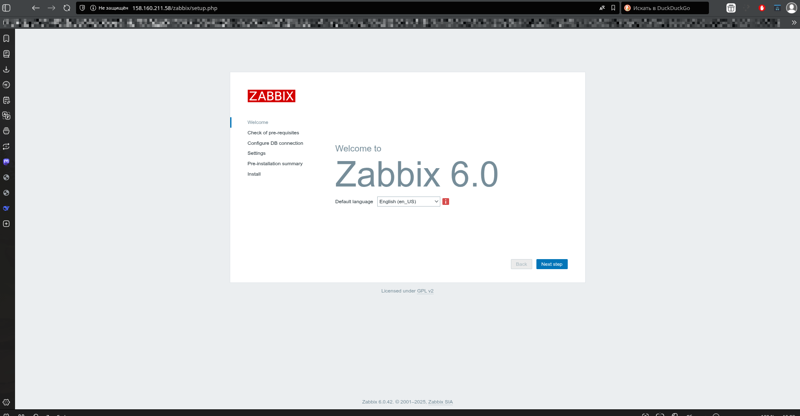

# Домашнее задание к занятию "Установка Zabbix Server с веб-интерфейсом" - Олег Шаров

### Инструкция по выполнению домашнего задания

1.  Сделайте `fork` данного репозитория к себе в Github и переименуйте его по названию или номеру занятия, например, https://github.com/ имя-вашего-репозитория/git-hw или https://github.com/ имя-вашего-репозитория/7-1-ansible-hw).
2.  Выполните клонирование данного репозитория к себе на ПК с помощью команды `git clone`.
3.  Выполните домашнее задание и заполните у себя локально этот файл README.md:
    -   впишите вверху название занятия и вашу фамилию и имя
    -   в каждом задании добавьте решение в требуемом виде (текст/код/скриншоты/ссылка)
    -   для корректного добавления скриншотов воспользуйтесь [инструкцией "Как вставить скриншот в шаблон с решением"](https://github.com/netology-code/sys-pattern-homework/blob/main/screen-instruction.md)
    -   при оформлении используйте возможности языка разметки md (коротко об этом можно посмотреть в [инструкции по MarkDown](https://github.com/netology-code/sys-pattern-homework/blob/main/md-instruction.md))
4.  После завершения работы над домашним заданием сделайте коммит (`git commit -m "comment"`) и отправьте его на Github (`git push origin`);
5.  Для проверки домашнего задания преподавателем в личном кабинете прикрепите и отправьте ссылку на решение в виде md-файла в вашем Github.
6.  Любые вопросы по выполнению заданий спрашивайте в чате учебной группы и/или в разделе “Вопросы по заданию” в личном кабинете.

Желаем успехов в выполнении домашнего задания!

### Дополнительные материалы, которые могут быть полезны для выполнения задания

1.  [Руководство по оформлению Markdown файлов](https://gist.github.com/Jekins/2bf2d0638163f1294637#Code)

---

### Задание 1

Настроить Zabbix Server с веб-интерфейсом на ВМ `debian-zabbix`. Установить PostgreSQL, Apache и компоненты Zabbix.

#### Этапы выполнения:

1.  Создана ВМ `debian-zabbix` в Yandex Cloud с параметрами: 2 vCPU, 2 ГБ RAM, 10 ГБ SSD, Debian 11.
2.  Подключился к ВМ по SSH.
3.  Обновил систему: `sudo apt update && sudo apt upgrade -y`
4.  Установил PostgreSQL: `sudo apt install postgresql -y`
5.  Установил репозиторий Zabbix 6.0:
    ```bash
    wget https://repo.zabbix.com/zabbix/6.0/debian/pool/main/z/zabbix-release/zabbix-release_6.0-4+debian11_all.deb
    sudo dpkg -i zabbix-release_6.0-4+debian11_all.deb
    sudo apt update
    ```
6.  Установил компоненты Zabbix:
    ```bash
    sudo apt install zabbix-server-pgsql zabbix-frontend-php zabbix-apache-conf zabbix-sql-scripts zabbix-agent -y
    ```
7.  Настроил базу данных PostgreSQL:
    ```bash
    sudo -u postgres createuser --pwprompt zabbix
    sudo -u postgres createdb -O zabbix zabbix
    zcat /usr/share/zabbix-sql-scripts/postgresql/server.sql.gz | sudo -u zabbix psql zabbix
    ```
8.  Настроил конфигурацию Zabbix Server:
    ```bash
    sudo nano /etc/zabbix/zabbix_server.conf
    ```
    Изменены строки:
    ```
    DBHost=localhost
    DBName=zabbix
    DBUser=zabbix
    DBPassword=MySecureZabbixPass123!
    ```
9.  Запустил и включил службу Zabbix Server:
    ```bash
    sudo systemctl start zabbix-server
    sudo systemctl enable zabbix-server
    ```
10. Установил и настроил Apache:
    ```bash
    sudo apt install apache2 -y
    sudo systemctl start apache2
    sudo systemctl enable apache2
    ```
11. Проверил конфигурацию PHP в `/etc/apache2/conf-enabled/zabbix.conf`, указал часовой пояс `Europe/Moscow`.
12. Перезапустил Apache: `sudo systemctl restart apache2`

`При необходимости прикрепитe сюда скриншоты
`

---

### Задание 2

Установлен Zabbix Agent на два хоста: `zabbix-agent-vm` и `debian-zabbix` (сам сервер под другим именем).

#### Этапы выполнения:

1.  На `zabbix-agent-vm` агент установлен, настроены параметры:
    ```
    Server=158.160.211.58
    ServerActive=158.160.211.58
    Hostname=zabbix-agent-vm
    ```
    Открыт порт 10050 в брандмауэре: `sudo ufw allow 10050/tcp`
2.  На `debian-zabbix` (сервер) установлен агент, настроены параметры:
    ```
    Server=127.0.0.1
    ServerActive=127.0.0.1
    Hostname=Zabbix-Server-Monitoring
    ```
    Исправлен путь в `LogFile=/var/log/zabbix/zabbix_agentd.log` — ранее был указан неверный путь, из-за чего агент не работал.
3.  Оба агента добавлены в веб-интерфейс Zabbix Server под уникальными именами.
4.  К обоим хостам применён шаблон `Template OS Linux`.
5.  Проверена передача данных в разделе **Monitoring > Latest data** — данные поступают от обоих агентов.


